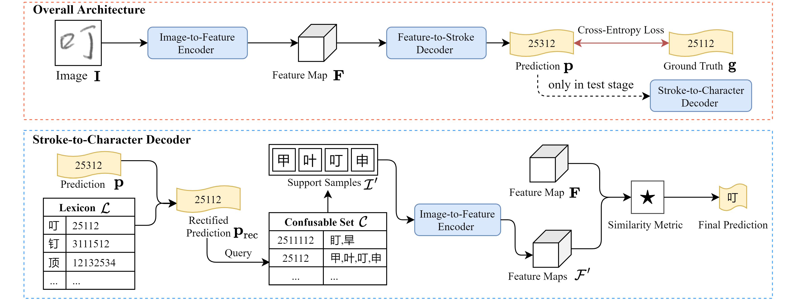

# Stroke Level Decomposition

This is the code for our IJCAI2021 paper "Zero-Shot Chinese Character Recognition with Stroke-Level Decomposition". [[link]](https://github.com/FudanVI/FudanOCR/tree/main/stroke-level-decomposition/document)




## Dependencies
Build up an environment with python3.6, and download corresponding libraries with pip
```python
pip install -r requirement.txt
```


## Experiment
Please remember to modify ```config.py``` and then execute